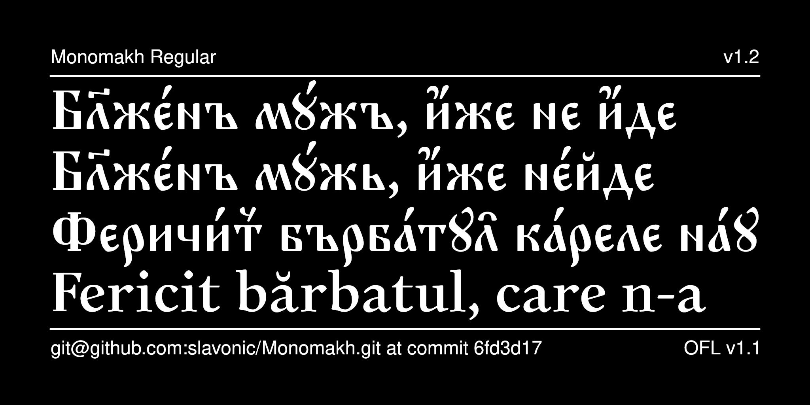

# Monomakh Typeface

Monomakh  is a Cyrillic font implemented in a mixed ustav/poluustav style and intended to cover needs of researches dealing with Slavic history and philology. It also provides Latin characters in a similar typeface, which is useful for working with multilingual academic editions.



## History

Monomakh was originally designed as [Monomachus by Alexey Kryukov](https://github.com/akryukov/monomachus), which was licensed under the SIL Open Font License. Since Monomachus has not been updated for many years, it was forked as Monomakh, with the addition of new features and characters that had been encoded in Unicode 9 and Unicode 10 by Aleksandr Andreev and Nikita Simmons.

## License

This Font Software is licensed under the SIL Open Font License,
Version 1.1. This license is available with a FAQ at
[https://openfontlicense.org/](https://openfontlicense.org/).

## Building the Fonts

The font source is stored in a FontForge SFD file in the `sources/` directory. All modifications should be made in FontForge, resulting in an updated SFD file. This file is then converted to UFO format by running the convert script. From terminal:

```
cd your/local/project/directory
./convert.sh
```

The font can then be built using fontmake and gftools by running:

```
make build
```

Note that this requires Python and will install all of the necessary libraries and tools into a virtualenv at `venv/`.

To delete the virtualenv and the results of the build, run:

```
make clean
```

To build the sample image the sits at the top of this README, run:

```
make images
```

The commands `make update` and `make update-project-template` update the repository structure and Python dependencies and should be run periodically.

Google's master repository also had a GitHub workflow for building the fonts in the cloud on push, but this seems to always fail because of incorrect dependencies, so has been disabled. Instead, built binaries are stored on GitHub in the `fonts/` directory.

This font has been added to [Google Fonts](https://fonts.google.com/specimen/Monomakh) and is available for use in Google Docs and other cloud-based software.

## Features

* Stylistic Set 1 (ss01) is provided as a temporary workaround to [LibreOffice Bug 85731](https://bugs.documentfoundation.org/show_bug.cgi?id=85731), which does not allow specifying the hyphenation character in LibreOffice. When turned on, the feature replaces all instances of U+002D
Hyphen-Minus and U+2010 Hyphen with U+005F Low Line (underscore)
for use as a hyphenation character.

* Stylistic Set 6 (ss06) displays U+0456 Cyrillic Small Letter Ukrainian / Belorussian I with one dot above and Stylistic Set 7 (ss07) displays the same character with two dots above. By default, U+0456 is displayed with no
dots.

* Stylistic Set 8 (ss08) displays the characters U+0417 Cyrillic Capital Letter Ze and U+0437 Cyrillic Small Letter Ze as a “sharp zemlya”, i.e., like the characters U+A640 Cyrillic Capital Letter Zemlya and U+A641 Cyrillic Small Letter Zemlya, respectively. Generally, this change should be handled at the codepoint level, so the use of this feature is discouraged.

* Stylistic Set 9 (ss09) displays the characters U+0427 Cyrillic Capital Letter Che and U+0447 Cyrillic Small Letter Che in their archaic form, with the descender in the middle.

* Stylistic Set 10 (ss10) displays the characters U+0429 Cyrillic Capital Letter Shcha and U+0449 Cyrillic Small Letter Shcha in their modern form, with the descender on the right.

* Stylistic Set 11 (ss11) displays the characters U+044B Cyrillic Small Letter Yeru and U+A651 Cyrillic Small Letter Yeru with Back Yer with the two glyphs connected.

* Stylistic Set 13 (ss13) displays the character U+0463 Cyrillic Small Letter Yat with the left stem extended to the baseline. Please note that this is not the same as U+A653 Cyrillic Small Letter Iotified Yat.

* The same functionality of these Stylistic Sets is provided in OpenType also by the Stylistic Alternatives (salt) feature.

See your software's documentation about how to access these glyphs.

## More Church Slavonic Fonts

See the [main repository](https://github.com/typiconman/fonts-cu/) and the [website](https://sci.ponomar.net/fonts.html).
